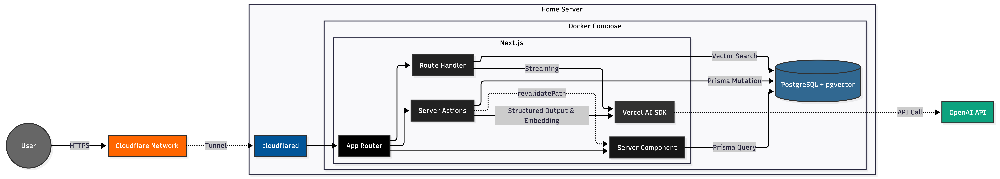

# Memoir

> LLM 기반 커리어 세컨드 브레인: 파편화된 경험을 강력한 커리어 자산으로.

Memoir는 파편화된 업무 기록을 AI를 통해 **검열 / 정제 / 벡터화**하여, 자신만의 커리어 코치를
구축하는 RAG 서비스입니다.

## Background

> "치열했던 고민의 기록, 휘발되지 않도록"

개발자로서 기술 블로그나 회고록을 작성하는 것은 중요하지만, 바쁜 현업과 사이드 프로젝트를 병행하며
이를 꾸준히 유지하기란 쉽지 않습니다.

1. **기록의 병목:** 트러블슈팅, 의사결정 근거 등 중요한 데이터가 노션, 깃허브, 메모장에 파편화되어
   사라집니다.
2. **자산화의 부재:** 면접이나 성과 평가 시즌이 되면 과거의 경험을 복기하는 데 과도한 에너지가
   소모됩니다.

Memoir는 기록에 들어가는 공수를 최소화하고, RAG를 통해 언제든 과거의 기술적 의사결정과 문제 해결
과정을 쉽게 확인할 수 있도록 돕습니다.

## Tech Stack

## Architecture

