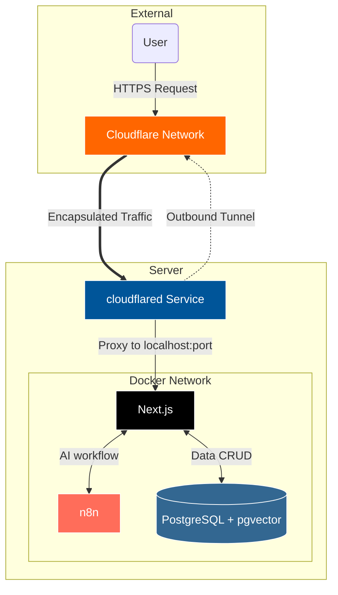

# Memoir

> LLM 기반 커리어 세컨드 브레인: 파편화된 경험을 강력한 커리어 자산으로.

Memoir는 파편화된 업무 기록을 AI를 통해 **검열 / 정제 / 벡터화**하여, 자신만의 커리어 코치를 구축하는 RAG 서비스입니다.

## Background

> "치열했던 고민의 기록, 휘발되지 않도록"

개발자로서 기술 블로그나 회고록을 작성하는 것은 중요하지만, 바쁜 현업과 사이드 프로젝트를 병행하며 이를 꾸준히
유지하기란 쉽지 않습니다.

1. **기록의 병목:** 트러블슈팅, 의사결정 근거 등 중요한 데이터가 노션, 깃허브, 메모장에 파편화되어 사라집니다.
2. **자산화의 부재:** 면접이나 성과 평가 시즌이 되면 과거의 경험을 복기하는 데 과도한 에너지가 소모됩니다.

Memoir는 기록에 들어가는 공수를 최소화하고, RAG를 통해 언제든 과거의 기술적 의사결정과 문제 해결 과정을 쉽게 확인할 수
있도록 돕습니다.

## Tech Stack

### Infra & Network

- Environment: Docker, Docker Compose
- Network: Cloudflare Tunnel (외부 노출 없는 보안 접속)
- Automation: n8n (LLM 워크플로우 및 데이터 파이프라인 엔진)
- CI/CD: Github Actions

### Application

- Frontend: Next.js (App Router), Tailwind CSS, shadcn/ui
- Backend: Next.js Route Handlers
- Language: TypeScript
- Package Manager: npm

### Data & AI

- Database: PostgreSQL + pgvector
- LLM: GPT-4o / Claude 3.5 Sonnet (via n8n)
- ORM: Prisma

## 배포 전략

> 그래프 첨부 예정

